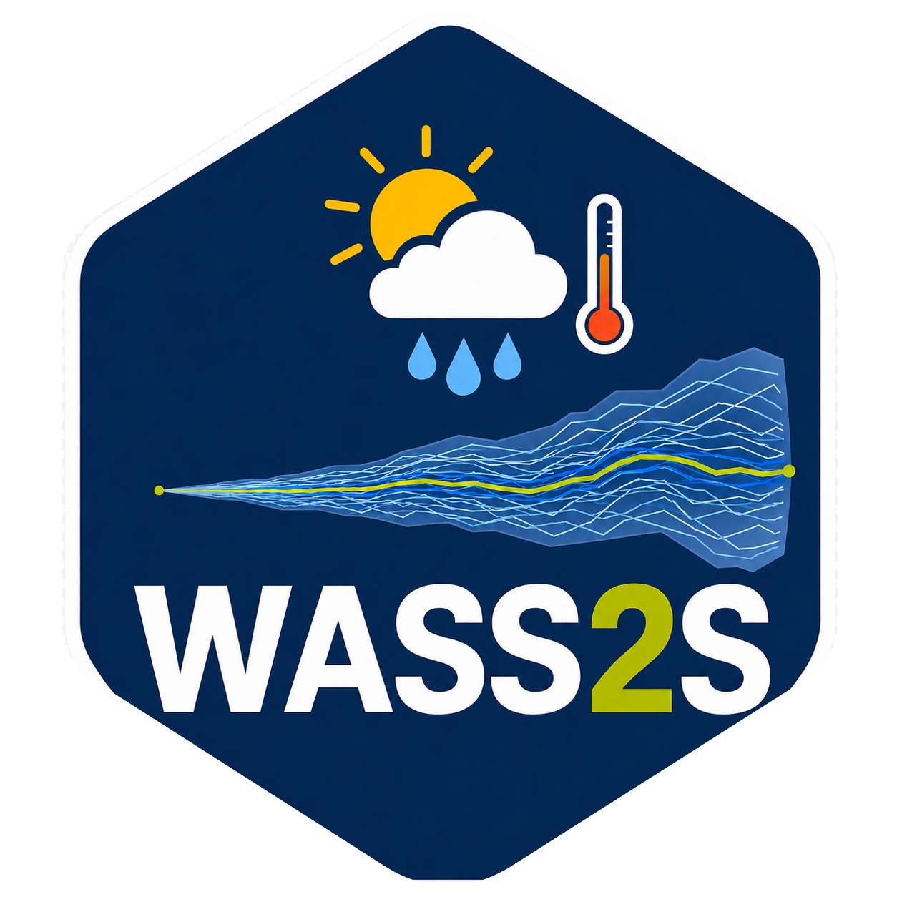
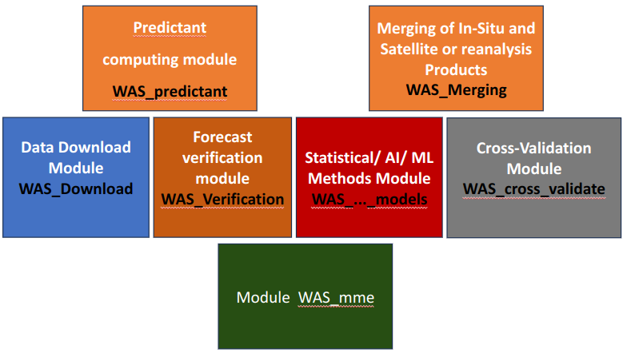

# WASS2S  


> A Python framework for reproducible seasonal climate forecasting.

[](https://pypi.org/project/wass2s/)
[](https://wass2s.readthedocs.io)
[](LICENSE)

**WASS2S** is an open-source Python framework for developing, verifying, and producing seasonal climate forecasts. Designed for operational climate services, researchers, and National Meteorological and Hydrological Services (NMHSs), it provides a reproducible workflow covering data acquisition, preprocessing, model development, verification, and forecast generation.

The framework follows the recommendations of the **World Meteorological Organization (WMO)** for objective and reproducible seasonal forecasting while supporting both traditional statistical methods and modern machine learning approaches.

## Features

- End-to-end seasonal forecasting workflow.
- Statistical and machine learning forecasting methods.
- Model verification using deterministic and probabilistic skill metrics.
- Automated download of seasonal forecast datasets.
- Interactive Jupyter notebooks.
- Publication-quality maps and graphics.
- Reproducible environments powered by Pixi.
- Modular architecture for extending forecasting methods.

Below, find the most important sub modules available in `WASS2S`



## Installation

### Recommended: Pixi

WASS2S is developed with **Pixi**, which automatically manages all Python, geospatial, and machine learning dependencies.

Install Pixi by following the official guide [here](https://pixi.sh/latest/installation/)

You may first need to install **Git** for your operating system in order to clone WASS2S repository. Find the appropriate instructions [here](https://git-scm.com/install/).

Verify the installation:

```bash
git --version
```
Clone WASS2S repository

```bash
git clone https://github.com/hmandela/WASS2S.git
cd WASS2S
```

Start the project environment:

```bash
pixi shell
```

Pixi automatically creates the environment the first time it is used.

You can also execute commands without activating the shell:

```bash
pixi run python
pixi run jupyter lab
```

### Activate WASS2S from any directory

Instead of changing into the project directory each time, you can start the environment directly:

```bash
pixi shell --manifest-path /path/to/WASS2S/pyproject.toml
```

#### Bash / zsh (Linux/macOS)

Add the following to your `~/.bashrc` or `~/.zshrc`.

Replace `/path/to/WASS2S` with the location of your local repository.

```bash
# wass2s utilities
export WASS2S_MANIFEST_PATH="/path/to/WASS2S/pyproject.toml"

wass2s_activate() {
    local manifest_path="${1:-$WASS2S_MANIFEST_PATH}"
    export _WASS2S_OLD_PATH="$PATH"
    export _WASS2S_OLD_PS1="$PS1"
    eval "$(pixi shell-hook --shell bash --manifest-path "$manifest_path")"
    echo "wass2s activated (manifest: $manifest_path)"
}

wass2s_deactivate() {
    if [ -z "${_WASS2S_OLD_PATH:-}" ]; then
        echo "wass2s: nothing to deactivate."
        return 1
    fi
    export PATH="$_WASS2S_OLD_PATH"
    export PS1="$_WASS2S_OLD_PS1"
    unset CONDA_PREFIX PIXI_ENVIRONMENT_NAME PIXI_PROJECT_ROOT _WASS2S_OLD_PATH _WASS2S_OLD_PS1
    echo "wass2s deactivated."
}
```

Reload your shell:

```bash
source ~/.bashrc
```

> **Login shell note:** `bash` only reads `~/.bashrc` for interactive non-login shells. Login shells (e.g. macOS Terminal.app by default, or a fresh SSH session on Linux) read `~/.bash_profile` instead. If the functions don't seem to load, add the following to `~/.bash_profile` so it sources `~/.bashrc` too:
>
> ```bash
> if [[ -f ~/.bashrc ]]; then
>   source ~/.bashrc
> fi
> ```
>
> For `zsh`, the equivalent split is `~/.zshrc` (interactive) vs `~/.zprofile` (login). Add the same kind of guard to `~/.zprofile`, sourcing `~/.zshrc` instead.

You can now activate and deactivate WASS2S from anywhere:

```bash
wass2s_activate
wass2s_deactivate
```

#### PowerShell (Windows)

Open your PowerShell profile:

```powershell
if (!(Test-Path $PROFILE)) {
    New-Item -ItemType File -Path $PROFILE -Force
}
notepad $PROFILE
```

Add the following, replacing `C:\path\to\WASS2S` with your local repository:

```powershell
# Path to the WASS2S Pixi manifest

$env:WASS2S_MANIFEST_PATH = "C:\path\to\WASS2S\pyproject.toml"

# wass2s_activate: activate WASS2S Pixi environment from anywhere
function wass2s_activate {
    param([string]$ManifestPath = $env:WASS2S_MANIFEST_PATH)

    # Prevent activation twice
    if ($env:WASS2S_ACTIVE -eq "1") {
        Write-Host "wass2s: already activated."
        return
    }

    # Save current PATH
    $env:_WASS2S_OLD_PATH = $env:PATH

    # Save the original PowerShell prompt
    $global:_WASS2S_OLD_PROMPT = $function:prompt

    # Remove invalid SSL certificate path if present
    Remove-Item Env:SSL_CERT_DIR -ErrorAction SilentlyContinue

    # Generate Pixi shell hook
    $hook = pixi shell-hook --shell powershell --manifest-path $ManifestPath |
        Out-String

    if ($LASTEXITCODE -ne 0 -or [string]::IsNullOrWhiteSpace($hook)) {
        Write-Error "wass2s: pixi shell-hook failed."
        return
    }

    # Apply Pixi environment
    Invoke-Expression $hook

    # Mark environment as active
    $env:WASS2S_ACTIVE = "1"

    # Add (wass2s) while preserving the original PowerShell prompt
    function global:prompt {
        Write-Host "(wass2s) " -NoNewline -ForegroundColor Green
        & $global:_WASS2S_OLD_PROMPT
    }

    Write-Host "wass2s activated (manifest: $ManifestPath)"
}

# wass2s_deactivate: deactivate WASS2S Pixi environment
function wass2s_deactivate {

    if ($env:WASS2S_ACTIVE -ne "1") {
        Write-Host "wass2s: nothing to deactivate."
        return
    }

    # Restore PATH
    $env:PATH = $env:_WASS2S_OLD_PATH

    # Restore original PowerShell prompt
    if ($global:_WASS2S_OLD_PROMPT) {
        Set-Item Function:\prompt $global:_WASS2S_OLD_PROMPT
    }

    # Remove WASS2S/Pixi environment variables
    Remove-Item Env:WASS2S_ACTIVE -ErrorAction SilentlyContinue
    Remove-Item Env:_WASS2S_OLD_PATH -ErrorAction SilentlyContinue
    Remove-Item Env:CONDA_PREFIX -ErrorAction SilentlyContinue
    Remove-Item Env:PIXI_ENVIRONMENT_NAME -ErrorAction SilentlyContinue
    Remove-Item Env:PIXI_PROJECT_ROOT -ErrorAction SilentlyContinue

    # Remove saved prompt
    Remove-Variable _WASS2S_OLD_PROMPT -Scope Global -ErrorAction SilentlyContinue

    Write-Host "wass2s deactivated."
}
```

Reload your profile:

```powershell
. $PROFILE
```

Then activate and deactivate with:

```powershell
wass2s_activate
wass2s_deactivate
```

### Install from PyPI

If you only need the Python package,

```bash
pip install wass2s
```
### Legacy Conda Environment

Legacy Conda environments remain available:

```bash
conda env create -f WAS_S2S_linux.yml
conda activate WASS2S
```

or

```bash
conda env create -f WAS_S2S_windows.yml
conda activate WASS2S
```

## Tutorial Notebooks

Example notebooks are available in the companion repository:

```bash
git clone https://github.com/hmandela/WASS2S_notebooks.git
```

## Climate Data Access

WASS2S supports downloading seasonal forecast datasets from the **Copernicus Climate Data Store (CDS)** and other supported data providers.

To enable downloads, create a CDS account and configure your API credentials as described [here](https://cds.climate.copernicus.eu/how-to-api).

## Documentation

Comprehensive documentation is available online.

- https://wass2s.readthedocs.io
- https://hmandela.github.io/WAS_S2S_Training/

## Contributing

Contributions are welcome.

Whether you're fixing bugs, improving documentation, implementing new forecasting methods, or adding tests, your contributions help improve WASS2S for the entire community.

Please read the [Contributing Guide](CONTRIBUTING.md) before opening an issue or submitting a pull request.


## Code of Conduct

To foster an open and welcoming community, all contributors are expected to follow the project's [Code of Conduct](CODE_OF_CONDUCT.md).

## Citation

If WASS2S contributes to your research, please cite the software.

GitHub provides a citation through the repository's **Cite this repository** button. Citation metadata are also available in `CITATION.cff`.

## License

WASS2S is distributed under the **GNU General Public License v3.0 (GPL-3.0)**.

See the [LICENSE](LICENSE) file for details.
